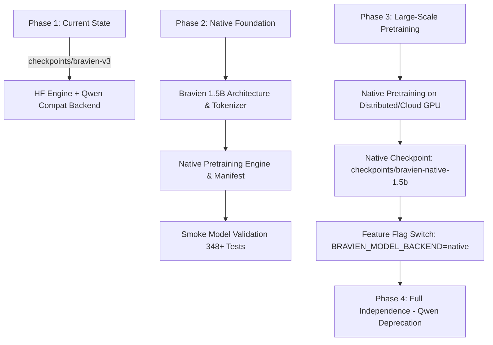

# Bravien Independence Audit & Qwen Dependency Mapping

## Executive Summary

Bravien's current production runtime (`checkpoints/bravien-v3`) is an instruction-tuned model fine-tuned from `Qwen/Qwen2.5-0.5B-Instruct`. This served as a rapid prototyping and research baseline across Stages 1 through 9.

The long-term mission for Bravien is **complete architectural and weights independence**: a custom, native **~1.5 Billion Parameter Model** (`bravien-1.5b`) with native tokenizer, custom pretraining pipeline, independent checkpoint format, and zero HuggingFace / Qwen runtime dependencies.

This document audits every current Qwen/HF dependency in the repository, classifies its operational criticality, and charts the non-breaking migration path to native Bravien.

---

## 1. Inventory of Current Qwen Dependencies

| Component / File | Specific Dependency | Classification | Target Migration State |
|---|---|---|---|
| `bravien/inference/hf_engine.py` | `AutoModelForCausalLM`, `AutoTokenizer`, `TextIteratorStreamer` | **Runtime (Current Production)** | Kept under `BRAVIEN_MODEL_BACKEND=qwen_compat`. Native engine `bravien/inference/engine.py` used when `BRAVIEN_MODEL_BACKEND=native`. |
| `bravien/inference/server.py` | Default checkpoint fallback to `Qwen/Qwen2.5-0.5B-Instruct` | **Runtime Fallback** | Fallback becomes `checkpoints/bravien-v3` (compat) → `checkpoints/bravien-native-1.5b` (native). |
| `bravien/training/hf_trainer.py` | `AutoModelForCausalLM`, `AutoTokenizer`, Qwen ChatML `<\|im_start\|>` format | **Training (SFT)** | Kept for SFT of HF baselines. `bravien/training/pretrain.py` & native SFT used for native models. |
| `scripts/download_model.py` | Downloads `Qwen/Qwen2.5-0.5B-Instruct` from HF Hub | **Tooling / Setup** | Replaced with `scripts/download_bravien_weights.py` / native artifact mirrors. |
| `scripts/evaluate_bravien.py` | Base Qwen vs Bravien-v1 comparison | **Evaluation (Historical)** | Replaced by `scripts/evaluate_native_bravien.py` and `scripts/stage9_benchmark.py`. |
| `scripts/benchmark_inference.py` | Checks `"Qwen"` substring in model path | **Benchmarking** | Updated to support both native `BravienForCausalLM` and HF backends. |
| `src/lib/ai/identity.ts` | References `"Qwen2.5-0.5B-Instruct"` in comments/prompts | **Application UX** | Updated to reference `"Bravien Native 1.5B (Local RTX 4050)"`. |
| `src/lib/ai/agent-state.ts` | References `Qwen 0.5B context budgeting` | **Application Logic** | Updated to dynamic context window budgeting (`maxContextTokens` from config). |
| `src/lib/vision/provider.ts` | Comments regarding text-only 0.5B model | **Application UX** | Retained / updated to reflect 1.5B capacity. |
| `checkpoints/bravien-v3/` | Qwen2 architectural weights & tokenizer files | **Model Artifact** | Retained as production baseline until native 1.5B model is fully trained & validated. |

---

## 2. Dependency Classification

### A. Runtime Critical (Active in Current v3)
- `bravien/inference/hf_engine.py`: Loads HF transformers weights in bfloat16/float16.
- `checkpoints/bravien-v3/`: Contains `model.safetensors`, `config.json`, `tokenizer.json` (Qwen2 architecture).

### B. Training-Only
- `bravien/training/hf_trainer.py`: Uses `transformers.Trainer` / custom HF loops for SFT fine-tuning.
- `scripts/train_bravien.py`: CLI driver for SFT fine-tuning.

### C. Tooling & Evaluation
- `scripts/download_model.py`: Pulls base weights from HuggingFace.
- `scripts/evaluate_bravien.py`: Side-by-side evaluator for base vs SFT models.

---

## 3. What Must Be Replaced for Full Independence

1. **Model Architecture**:
   - Must not use `transformers.models.qwen2.modeling_qwen2.Qwen2ForCausalLM`.
   - Must use native `bravien.model.bravien_model.BravienForCausalLM` implementing clean PyTorch causal transformer (RoPE, RMSNorm, SwiGLU Gated MLP, GQA, KV Cache).

2. **Tokenizer**:
   - Must not use Qwen's 152k vocabulary or Qwen tokenizer files.
   - Must use native `bravien.tokenizer.BravienTokenizer` trained on Bravien's curated multilingual (English, Hindi, Hinglish, Code, Math) corpus with ~32k to 64k vocabulary.

3. **Checkpoint Format**:
   - Must use native standalone checkpoint layout containing `model_config.json`, `model.safetensors` / `model.pt`, `tokenizer.json`, `manifest.json` with cryptographic SHA-256 integrity checksums.

4. **Inference Engine**:
   - Must run directly through native `BravienInferenceEngine` without requiring HuggingFace Hub network calls or HF model registration.

---

## 4. What Can Remain as Compatibility Tooling

- `bravien/inference/hf_engine.py`: Retained under `BRAVIEN_MODEL_BACKEND=qwen_compat` so existing checkpoints (`bravien-v1`, `bravien-v2`, `bravien-v3`) continue functioning seamlessly without disruption.
- `bravien/training/hf_trainer.py`: Retained for comparative benchmarking against external open-source models.

---

## 5. Non-Breaking Migration Path

1. **Step 1 (Immediate)**: Implement native architecture (`bravien/model/bravien_*.py`), tokenizer pipeline (`bravien/tokenizer/`), native pretraining engine (`bravien/training/pretrain.py`), and validation tools.
2. **Step 2 (Feature Flagging)**: Provide `BRAVIEN_MODEL_BACKEND=qwen_compat` (default, runs v3) and `BRAVIEN_MODEL_BACKEND=native` (runs native Bravien).
3. **Step 3 (Pretraining)**: Pretrain the ~1.5B parameter architecture on target compute.
4. **Step 4 (Validation)**: Run Stage 9 benchmark (35 dimensions) on native model.
5. **Step 5 (Cutover)**: Switch default backend to `native` and archive legacy Qwen assets.
