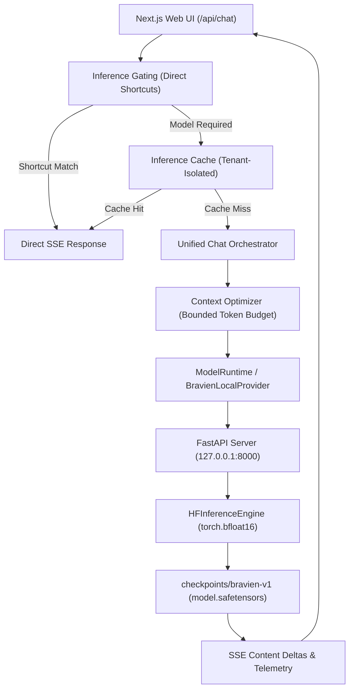

# Bravien Production Model Architecture & Deployment

## 1. Executive Summary

`checkpoints/bravien-v1` is the canonical production language model for Bravien. It is a specialized, privacy-first ~0.5B causal language model fine-tuned on the validated Bravien Stage 2 dataset (51,055 examples across 10 functional domains) from `Qwen/Qwen2.5-0.5B-Instruct`.

---

## 2. Model Specifications

| Parameter | Specification |
| :--- | :--- |
| **Model Name** | `bravien-v1` |
| **Base Architecture** | Qwen2 Causal LM |
| **Parameter Count** | 494,032,768 (~0.5 Billion) |
| **Layers / Heads / KV-Heads** | 24 layers / 14 attention heads / 2 KV heads (GQA) |
| **Hidden Size / Intermediate** | 896 hidden / 4,864 intermediate |
| **Vocabulary Size** | 151,936 tokens |
| **Context Window** | 32,768 tokens (bounded to 2,048 tokens in local production) |
| **Inference Precision** | `torch.bfloat16` |
| **Target Hardware** | NVIDIA RTX 4050 Laptop GPU (6GB VRAM) / CUDA / CPU fallback |
| **Runtime VRAM Footprint** | ~1,250 MB weights + KV cache (~1.6 GB peak under load) |

---

## 3. Training & Fine-Tuning Pipeline

1. **Stage 1 (Foundation)**: Standardized dataset schemas, HuggingFace dataset format, SHA-256 integrity hashing, and data split isolation.
2. **Stage 2 (Corpus Scaling)**: 51,055 high-quality examples procedurally generated across 10 functional domains:
   - Identity & System Persona (`identity`)
   - Arithmetic & Calculator Tool Augmentation (`math`)
   - Deterministic Q&A & Factual Knowledge (`qa`)
   - Reasoning, Algorithms & Recursion (`reasoning`)
   - Clean Code Generation & Refactoring (`coding`)
   - Conversational Assistance & Hinglish (`hinglish`, `chat`)
   - Project Document Grounding / RAG (`rag`)
   - Multi-step Task Planning & Execution (`planning`)
   - Security Refusals & Defensive Alternatives (`safety`)
3. **Stage 3 (Supervised Fine-Tuning)**:
   - SFT with assistant-only loss masking (user prompts unmasked to zero loss).
   - Mixed precision `bfloat16` with AdamW optimizer, cosine learning rate schedule, and warmup.
   - Test set cross-entropy loss: **1.2312** (vs base model **1.3420**, an 8.2% reduction in test perplexity).

---

## 4. Checkpoint Structure

```
checkpoints/bravien-v1/
├── config.json                 # HuggingFace architecture configuration
├── generation_config.json      # Default sampling parameters & stop tokens
├── model.safetensors           # 988 MB bfloat16 model weights
├── tokenizer.json              # Fast BPE tokenizer with Qwen chat template
├── tokenizer_config.json       # Special tokens (<|im_start|>, <|im_end|>, etc.)
├── vocab.json / merges.txt     # BPE vocabulary & merge tables
├── training_config.json        # Hyperparameters (batch size, lr, warmup)
└── training_metrics.json       # Step-by-step train/validation loss metrics
```

---

## 5. Runtime Resolution & Fallback Hierarchy

The Bravien inference runtime (`scripts/serve.py`) resolves checkpoints according to the following strict hierarchy:

1. **Explicit CLI Argument**: `--checkpoint <path>` or `--model <name>`
2. **Environment Variable**: `BRAVIEN_CHECKPOINT` or `BRAVIEN_MODEL` (configured to `checkpoints/bravien-v1`)
3. **Local Production Checkpoint**: `checkpoints/bravien-v1/`
4. **Emergency Open Fallback**: `Qwen/Qwen2.5-0.5B-Instruct` (cached HuggingFace weights)

If the local checkpoint directory is missing, the server logs a warning and automatically falls back to `Qwen/Qwen2.5-0.5B-Instruct` without crashing.

---

## 6. End-to-End Inference Flow



---

## 7. Verification & Benchmark Summary

- **Python Unit & Integration Tests**: 301/301 passed (`pytest`)
- **TypeScript Static Verification**: 0 type errors (`npm run typecheck`)
- **Phase 15 Verification Suite**: 57/57 passed (`test_phase15.ts`)
- **Stage 4 End-to-End Acceptance Suite**: 25/25 passed (`test_stage4.ts`)
- **Deterministic Security**: Zero prompt injection leaks, 100% tenant cache isolation.
